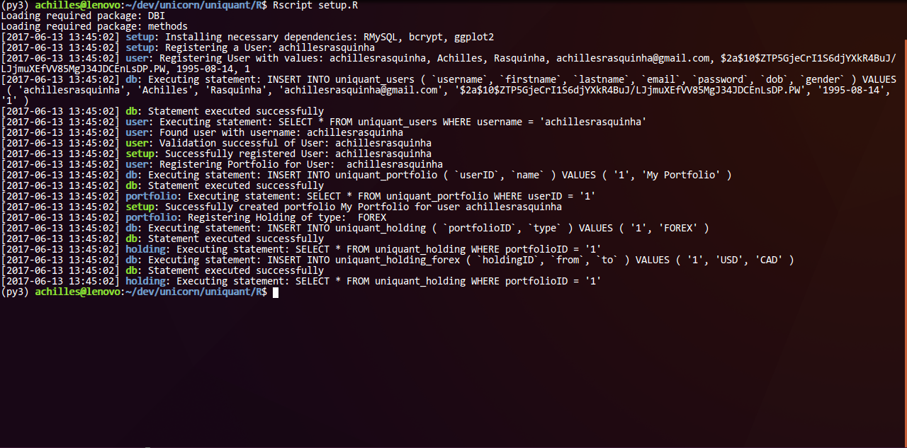

# uniquant

### Table of Contents
* [Environment Variables](#environment-variables)
  * [General Environment Variables](#general-environment-variables)
  * [Database Environment Variables](#database-environment-variables)
* [Example](#example)
* [Debugging](#debugging)

### Environment Variables
* #### General Environment Variables
  * `UNIQUANT_PACKAGE_MIRROR`: *CRAN mirror to download packages from. (default - http://cran.us.r-project.org)*

* #### Database Environment Variables
  * `UNIQUANT_DB_NAME`: Database Name (default - `uniquant`)
  * `UNIQUANT_DB_HOST`: Host Name for your database (default - `127.0.0.1`)
  * `UNIQUANT_DB_PORT`: Port Number for your database (default - `0`)
  * `UNIQUANT_DB_USER`: A database username (default - `root`)
  * `UNIQUANT_DB_PASS`: Password for the said username (default - `toor`)
  * `UNIQUANT_DB_PREFIX`: Prefixes for table names (default - `UNIQUANT_DB_NAME_tablename`)
  * `UNIQUANT_PASSWORD_SALT`: A numeric salt value for the **bcrypt** password hashing algorithm. Bigger the number, bigger the complexity for encryption/decryption. (default - `10`)

### Example
Run the `setup.R` script as follows:
```console
$ Rscript setup.R
```

### Debugging
`uniquant` has a neat color-signaled debugging framework. To launch into debug mode, simply:
```r
> source('util/log.R')
> log.DEBUG <- TRUE
```

You should then have your terminal output as follows:


### Documentation

* #### Entities
  * ##### Users
    * `user.register`
      A helper function to register new users. Returns a `data.frame` with a single row containing user details or `NULL` if a user with a same `username` or `email` has been already registered. Passwords are **bcrypt hashed**.
      ```r
      > source('constant.R')    # gender
      > source('entity/user.R')

      > user <- user.register(
      +   username  = 'achillesrasquinha',
      +   firstname = 'Achilles',
      +   lastname  = 'Rasquinha',
      +   email     = 'achillesrasquinha@gmail.com',
      +   password  = '12345',
      +   dob       = '1995-08-14',
      +   gender    = gender.MALE
      + )
      ```
    * `user.get`
      A helper function to retrieve user information. Requires a `username` and `password`.
      ```r
      > source('entity/user.R')
      > user <- user.get('achillesrasquinha', '12345')
      ```
  * ##### Portfolio
    * `user.register_portfolio`
      A helper function to create new portfolio for a said user. Returns a `data.frame` with a single row containing portfolio details.
      ```r
      > source('entity/user.R')
      > user <- user.get('achillesrasquinha', '12345')
      > user.register_portfolio(user, name = 'My Portfolio')
      ```
    * `portfolio.get`
      A helper function to retrieve details about all/specific portfolios. Returns a `data.frame` containing portfolio details for a particular user.
      ```r
      > source('entity/user.R')
      > source('entity/portfolio.R')
      > user <- user.get('achillesrasquinha', '12345')
      > portfolio.get(user)
        ID userID               name
      1  2      1 My Other Portfolio
      2  1      1       My Portfolio
      > # OR
      > portfolio.get(user, name = c("My Portfolio", "My Other Portfolio"))
        ID userID               name
      1  2      1 My Other Portfolio
      2  1      1       My Portfolio
      > portfolio.get(user, name = "My Portfolio")
        ID userID               name
      1  1      1       My Portfolio
